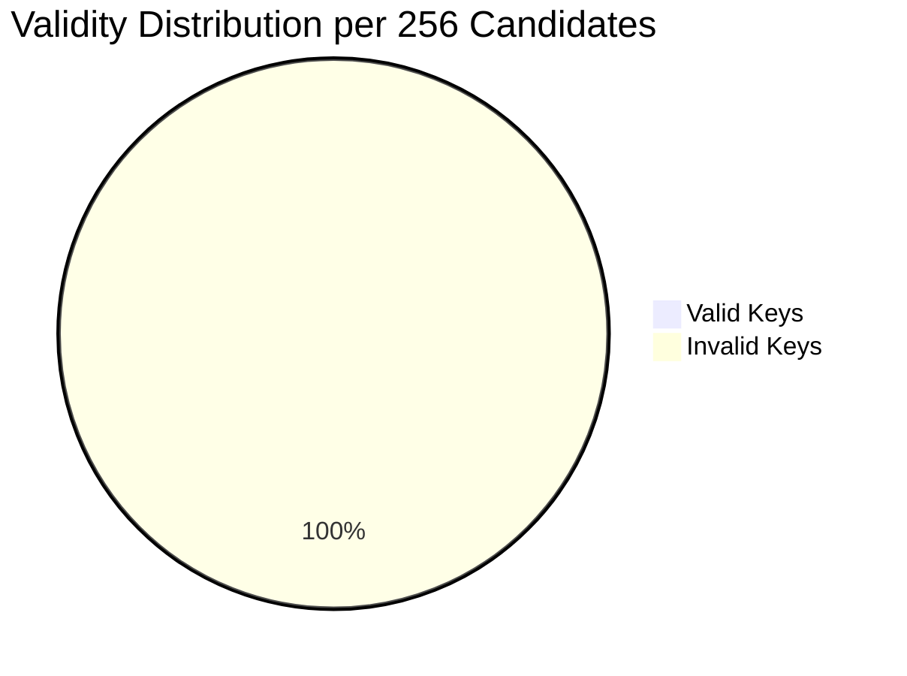

# casa
ALL CASACIOUS BITS (22,23,26,30) ARE INCLUDED WITH RIPMD160 GENERATOR

---

# Possibility:

### Understanding the Probability of Valid Casascius Mini Keys

Each Casascius mini key candidate is designed as a 30-character string using Base58 symbols. Since Base58 has 58 possible characters per position, the total number of raw variations for a full 30-character string is:

- **Total Variations:** 58³⁰ ≈ 2¹⁵⁰

However, in the Casascius scheme, every mini key must start with the character **S**. This requirement fixes the first character and reduces the possible combinations to:

- **Candidates with 'S' fixed:** 58²⁹ ≈ 2¹⁴⁵

Not every candidate key is a valid Casascius mini key. The validity condition is defined by a checksum rule: when you append a `'?'` to the mini key and compute its SHA-256 hash, the resulting hash must start with `0x00`. Since a SHA-256 hash is 256 possible values for the first byte, only 1 out of every 256 candidate keys will pass this test.

Thus, the probability that a randomly generated mini key candidate is valid is:

- **Probability:** 1/256 (≈ 0.39%)

When we apply this probability to the candidate space, the effective number of valid Casascius mini keys is:

- **Valid Keys:** (58²⁹) / 256 ≈ 2¹⁴⁵ / 2⁸ = 2¹³⁷

Even after reducing by a factor of 256, the valid key space (approximately 2¹³⁷ possibilities) remains astronomically huge.

### Diagram: Valid vs. Invalid Candidate Keys

Below is a pie chart illustrating the distribution for every 256 candidate keys:





This diagram shows that for every 256 candidate mini keys, only 1 is valid according to the Casascius checksum rule.

### Summary

- **Total Candidate Keys (with 'S' fixed):** ≈ 2¹⁴⁵  
- **Validity Condition:** SHA-256(mini key + '?') must start with 0x00  
- **Probability of Validity:** 1/256 (≈ 0.39%)  
- **Effective Valid Keys:** ≈ 2¹³⁷  

These numbers illustrate why finding a valid Casascius mini key by random search is computationally formidable—while the candidate space is enormous, only a tiny fraction meet the stringent checksum requirement.

---

# Casascius Mini Key Generator and Validator

An advanced, multi-threaded tool for generating and validating Casascius mini keys—compact representations of Bitcoin private keys. This project implements efficient key generation, checksum validation, cryptographic derivation (private/public keys, Bitcoin addresses), and target hash matching using a Bloom filter. It supports both random and sequential modes, includes robust logging and performance monitoring, and is optimized for multi-core systems.

---

## Table of Contents

1. [Overview](#overview)
2. [Features](#features)
3. [Requirements](#requirements)
4. [Installation](#installation)
5. [Usage](#usage)
    - [Command-Line Options](#command-line-options)
    - [Usage Examples](#usage-examples)
6. [Key Modules and Functions](#key-modules-and-functions)
    - [Global Configuration](#global-configuration)
    - [Bloom Filter](#bloom-filter)
    - [Key Generation and Validation](#key-generation-and-validation)
    - [Cryptographic Functions](#cryptographic-functions)
    - [Utility Functions](#utility-functions)
7. [Workflow Flowchart](#workflow-flowchart)
8. [Understanding Mini Key Strength](#understanding-mini-key-strength)
9. [Logging, Performance, and Contributing](#logging-performance-and-contributing)
10. [License](#license)
11. [Donations](#donations)

---

## Overview

Casascius mini keys are short alphanumeric strings (typically 22, 23, 26, or 30 characters long) that encode Bitcoin private keys. This project provides a C++ solution to generate these keys and validate them using the Casascius checksum rule—where appending a `'?'` to the key and taking its SHA-256 hash must yield a hash starting with `0x00`. In addition, the tool derives corresponding private keys, compressed and uncompressed public keys, and Bitcoin addresses. It also offers an optional feature to check generated keys against target RIPEMD160 hashes for advanced filtering.

---

## Features

- **Multi-threaded Execution:** Fully utilizes multiple CPU cores for rapid key generation.
- **Random & Sequential Modes:** Choose between random key generation or sequential mode with resume capability.
- **Customizable Key Lengths:** Supports mini keys of 22, 23, 26, or 30 characters.
- **Target Hash Matching:** Uses an optimized Bloom filter to efficiently check against provided RIPEMD160 hashes.
- **Comprehensive Logging:** Detailed logs for valid keys, matched targets, and sequence progress.
- **Real-Time Performance Metrics:** Displays keys per second along with counts of valid and invalid keys.
- **Graceful Shutdown:** Cleanly handles user interruptions (e.g., via Ctrl+C).

---

## Requirements

- **C++ Compiler:** Requires C++11 or later (e.g., `g++`).
- **OpenSSL Library:** For cryptographic functions (SHA-256, RIPEMD160, and elliptic curve operations).
- **Operating System:** Tested on Linux and macOS. Windows users may need to perform additional configuration.
- **Dependencies:** (On Ubuntu) Install using:

  ```bash
  sudo apt-get install libssl-dev
  ```

---

## Installation

Clone the repository and compile the program with your preferred C++ compiler:

```bash
git clone https://github.com/Shubsaini08/casa.git
cd casa 
sudo apt-get install libssl-dev  # Ubuntu/Debian users
g++ -o casa main.cpp -std=c++11 -pthread -lssl -lcrypto
```

---

## Installation for CMD:

[SECP256K1](https://github.com/bitcoin-core/secp256k1) Make sure to have it in your system :) 

Clone the repository and compile the program with your preferred C++ compiler:

```bash
git clone https://github.com/Shubsaini08/casa.git
cd casa 
g++ -o casa.exe main.cpp -std=c++11 -pthread -lssl -lcrypto
```

---

## Usage

### Command-Line Options

| Option                    | Description                                                  | Example                                            |
|---------------------------|--------------------------------------------------------------|----------------------------------------------------|
| `-h`, `-help`             | Display usage instructions                                   | `./casa -h`                                        |
| `-p N`, `-print N`        | Set performance print interval (in seconds)                  | `./casa -p 10`                                     |
| `-S [key]`, `-seq [key]`   | Enable sequence mode; resume from the specified key          | `./casa -S S00000001`                              |
| `-t N`, `-core N`         | Specify the number of threads                                | `./casa -t 4`                                      |
| `-b N`, `-bit N`          | Set the mini key length (22, 23, 26, or 30)                    | `./casa -b 22`                                     |
| `-f F`, `-file F`         | Load target RIPEMD160 hashes from file                       | `./casa -f targets.txt`                            |
| `-log`                    | Enable logging of progress (logs every 1e9 keys)               | `./casa -log`                                      |
| `--derive <key>`          | Display detailed derivation for a given mini key               | `./casa --derive S6c56bnXQiBjk9mqSYE7ykVQ7NzrRy`     |
| `--multi`                | Generate keys with random lengths (22, 23, 26, or 30)          | `./casa --multi`                                   |

### Usage Examples

1. **`-h` or `-help`**  
   **Description:** Displays the help guide with usage instructions.  
   **Example:**
   ```bash
   ./casa -h
   ```
   **Output:** Usage instructions.

2. **`-p N` or `-print N`**  
   **Description:** Sets the performance print interval to N seconds.  
   **Example:**
   ```bash
   ./casa -p 10
   ```
   **Output:** Prints stats (keys/sec, valid/invalid counts) every 10 seconds.

3. **`-S` or `-seq [key]`**  
   **Description:** Enables sequential mode. If no key is provided, it resumes from the last key stored in `sequence_log.txt`.  
   **Examples:**  
   - **Resume from last logged key:**
     ```bash
     ./casa -S
     ```
     If `sequence_log.txt` contains `S000000000000000000005`, the program will start at `S000000000000000000006`.

   - **Start from a specific key:**
     ```bash
     ./casa -S S000000000000000000010
     ```
     The program will start at `S000000000000000000011`.

4. **`-t N` or `-core N`**  
   **Description:** Sets the number of worker threads for key generation.  
   **Example:**
   ```bash
   ./casa -t 4
   ```
   **Output:** Uses 4 threads for generation.

5. **`-b N` or `-bit N`**  
   **Description:** Sets the mini key length. Available options are 22, 23, 26, or 30 characters.  
   **Example:**
   ```bash
   ./casa -b 26
   ```
   **Output:** Generates 26-character mini keys.

6. **`-f F` or `-file F`**  
   **Description:** Specifies a file containing target RIPEMD160 hashes.  
   **Example:**
   ```bash
   ./casa -f targets.txt
   ```
   **Output:** The program checks generated keys against the hashes in `targets.txt`.

7. **`-log`**  
   **Description:** Enables logging. Logs progress to `sequence_log.txt` every 1e9 keys.  
   **Example:**
   ```bash
   ./casa -log
   ```

8. **`--derive <casakey>`**  
   **Description:** Analyzes and outputs detailed derivation information for a specific mini key (including private key, public keys, and addresses).  
   **Example:**
   ```bash
   ./casa --derive S6c56bnXQiBjk9mqSYE7ykVQ7NzrRy
   ```

9. **`--multi`**  
   **Description:** Generates mini keys with random lengths (choosing among 22, 23, 26, or 30 characters).  
   **Example:**
   ```bash
   ./casa --multi
   ```

### Combined Examples

- **Example 1:** Generate keys with 8 threads, key length 30, a target file, logging enabled, and performance stats every 60 seconds.
  ```bash
  ./casa -t 8 -b 30 -f targets.txt -log -p 60
  ```

- **Example 2:** Start in sequential mode using 4 threads with performance stats every 30 seconds.
  ```bash
  ./casa -S -t 4 -p 30
  ```

- **Example 3:** Generate mini keys with random lengths using 2 threads and check against a target file.
  ```bash
  ./casa --multi -t 2 -f targets.txt
  ```

---

## Key Modules and Functions

### Global Configuration

Global variables control the state and behavior of the program:
- **Counters:**  
  - `keyCounter`: Total keys generated  
  - `validKeyCounter`: Valid mini keys  
  - `invalidKeyCounter`: Invalid mini keys  
  - `matchCounter`: Keys matching target hashes
- **Configurations:**  
  - `miniKeyLength`: Default is 22; configurable to 22, 23, 26, or 30  
  - `numThreads`: Default is 1  
  - `printInterval`: Performance update interval (in seconds)  
  - `LOG_INTERVAL`: Logs progress every 1e9 keys
- **Modes:**  
  - `sequenceMode`, `loggingMode`, and `multiMode`
- **Log Files:**  
  - `saved.txt`, `casascius_found.txt`, and `sequence_log.txt`

### Bloom Filter

A Bloom filter is implemented for rapid target hash checking:
- **Size:** Approximately 1e9 bits (~125MB)
- **Hash Functions:** Utilizes 7 distinct hash functions
- **Purpose:** Quickly determines whether a generated key's RIPEMD160 hash might be in the target set, minimizing expensive lookups.

### Key Generation and Validation

- **Random Generation:**  
  `randomMiniKey` generates a mini key beginning with 'S' followed by random alphanumeric characters.
- **Sequential Generation:**  
  `generateSequentialMiniKey` produces keys by incrementing a global index and zero-padding as necessary.
- **Validation:**  
  `isValidMiniKey` appends a `'?'` to the key and checks if the SHA-256 hash starts with `0x00`, ensuring compliance with Casascius' checksum rule.

### Cryptographic Functions

- **Private Key Derivation:**  
  `derivePrivateKey` computes the SHA-256 hash of the mini key.
- **Public Key Generation:**  
  `derivePublicKey` uses OpenSSL to derive both compressed and uncompressed public keys via the secp256k1 curve.
- **RIPEMD160 Hashing:**  
  `computeRipemdFromPubKey` performs SHA-256 on the public key, then applies RIPEMD160.
- **Bitcoin Address Generation:**  
  `generateBTCAddress` creates Base58-encoded Bitcoin addresses from the hash data.

### Utility Functions

- **Base58 Encoding:**  
  Implements Base58 conversion for Bitcoin addresses and Wallet Import Format (WIF) keys.
- **Target Hash Loading:**  
  `loadTargetHashes` reads 40-character hex RIPEMD160 hashes from a file and adds them to the Bloom filter.
- **Key Derivation Process:**  
  `processDerive` outputs detailed key information, including derived private key, public keys, addresses, and WIF.

---

## Workflow Flowchart

```mermaid
flowchart TD
    A[Start]
    B[Parse Arguments]
    C{--derive option?}
    D[Process Derivation and Exit]
    E[Initialize Bloom Filter (if targets provided)]
    F[Open Log Files]
    G[Launch Worker Threads]
    H[Generate and Validate Mini Keys]
    I[Log Valid Keys and Matches]
    J{Performance Monitoring (-p enabled)?}
    K[Display Performance Metrics]
    L[Wait for Threads to Complete]
    M[Graceful Shutdown]
    N[Exit]
    
    A --> B
    B --> C
    C -- Yes --> D
    C -- No --> E
    E --> F
    F --> G
    G --> H
    H --> I
    I --> J
    J --> K
    K --> L
    L --> M
    M --> N
```

---

## Understanding Mini Key Strength

The strength (or total possible combinations) of a mini key depends on its length:

| Length | Composition         | Approximate Combinations  |
|--------|---------------------|---------------------------|
| 22     | `S` + 21 characters | ~4.19 million             |
| 23     | `S` + 22 characters | ~8.39 million             |
| 26     | `S` + 25 characters | ~67.11 million            |
| 30     | `S` + 29 characters | ~1.07 billion             |

*Note: The actual entropy is lower due to a limited character set and the checksum constraint.*

---

## Logging, Performance, and Contributing

### Logging and Output

- **`saved.txt`:**  
  Logs all valid keys with their corresponding private keys and hash details.
- **`casascius_found.txt`:**  
  Records keys that match any target RIPEMD160 hash.
- **`sequence_log.txt`:**  
  Maintains progress updates (every 1e9 keys) when logging is enabled.

### Performance Monitoring

When the `-p` option is used, the tool outputs real-time performance metrics:
- Keys generated per second.
- Interval-based valid/invalid key counts.
- Cumulative totals since the program started.

### Contributing

Contributions are welcome! To contribute:
1. Fork the repository.
2. Create a new branch for your feature or fix.
3. Submit a pull request with clear details of your changes.

For major changes, please open an issue first to discuss what you would like to modify.

---

## License

This project is licensed under the MIT License. See the [LICENSE](LICENSE) file for full details.

---

## Donations

If you find this project valuable, please consider supporting its ongoing development:

- **Email:** keyfoundhunt4ever@gmail.com
- **Telegram:** [@Shainshub](https://t.me/Shainshub)

Join our community channels for further discussion and updates:

HOPE IT WILL HELP
[FOR ANY QUESTIONS TEXT US AT]

> MUST VISIT AND JOIN OUR BLOCKCHAIN :: https://t.me/Blythexweb
>
> A WAY AHEAD BLOCKCHAIN THATS SPECIALLY DESIGNED FOR MONITORING HIDDEN TRANSACTIONS 
>
> code_Crusaders0 :: https://t.me/code_Crusaders0
> 
> KEYFOUND ::  https://t.me/privatekeydirectorygroup
> 
> ALSO FOR TRADING WITH BOTS :: https://t.me/+ggaun3gLB900MGY0
> 
> GITHUB LINK FOR MORRE :: https://github.com/Shubsaini08
> 
> KEYFOUND VURTUAL ASSISTANT ::  https://t.me/Shubfind_bot
>
> CODE_CRUSADERS0 VURTUAL ASSISTANT :  https://t.me/Code_Crusaders_bot
>

---
Thank you for your support, and happy key hunting!

---

Have a wonderful day, stay blessed, and may success be just a key away!
